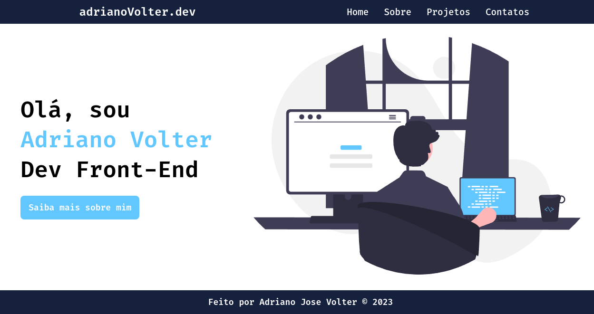
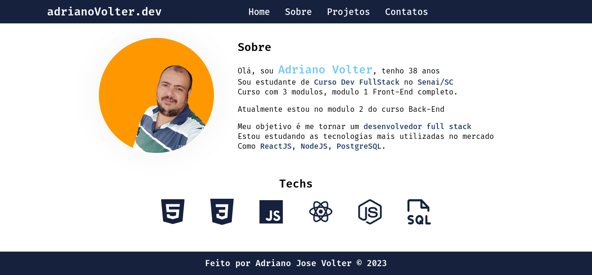
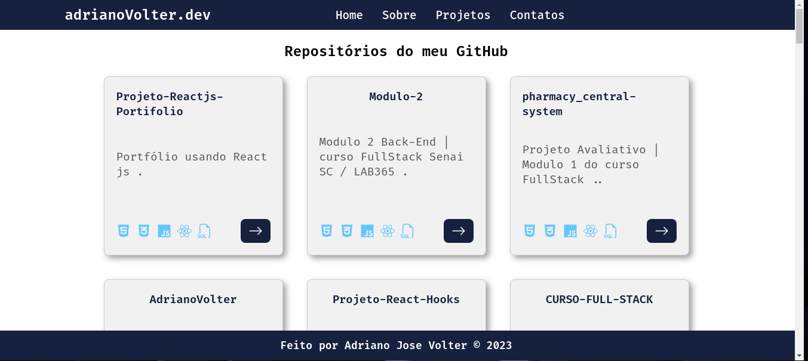
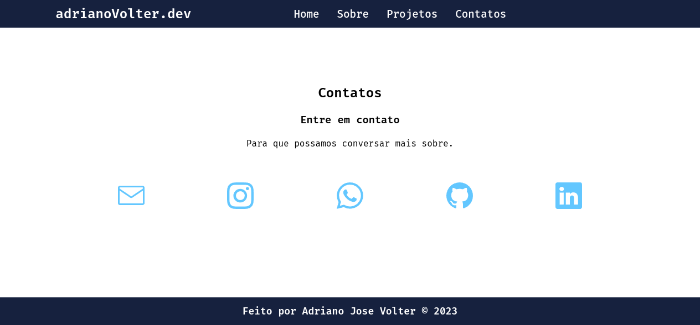
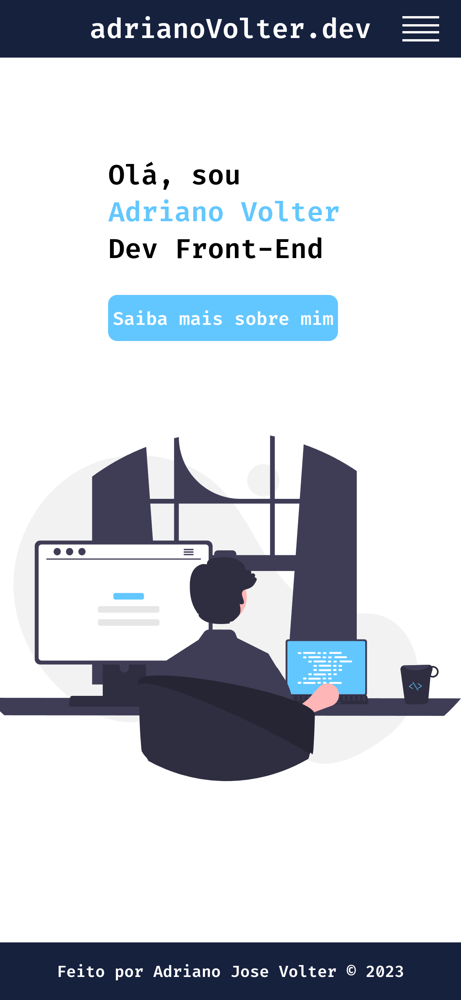

## Portifólio pessoal 

 Portifólio pessoal feito em React, com o intuito de mostrar meus projetos e habilidades. 

### Tenologias usadas: 

  

<li>React 
<li>Css 
<li>Html 
<li>JS
<li>Vite
<li>Docker

### Dependências usando o comando `npm install`:

<li>React-dom
<li>React-router-dom
<li>React-icons

### Para rodar o projeto use o comando `npm run dev`:

### Usando docker para rodar o projeto:

<li>docker build -t portifolio-react .
<li>docker run -p 5000:5000 portifolio-react

## Projeto hospedado na Vercel:

Foi usado a vercel para hospedar o projeto, pois é uma plataforma que facilita o deploy de projetos front-end, e também é uma plataforma gratuita.
Usado CI para fazer o deploy automático do projeto, toda vez que é feito um push no repositório do github, o projeto é atualizado na vercel , usando um container nginx.

### Link do projeto:

<a href="https://portifolio-react-phi.vercel.app/">Portifólio</a>
### Pagina inicial:

### Pagina de sobre:

### Pagina de projetos:

### Pagina de contato:

### Pagina com responsividade:

   